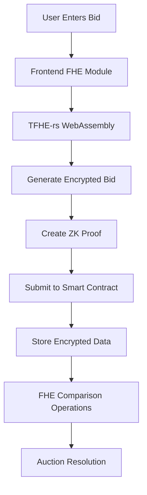
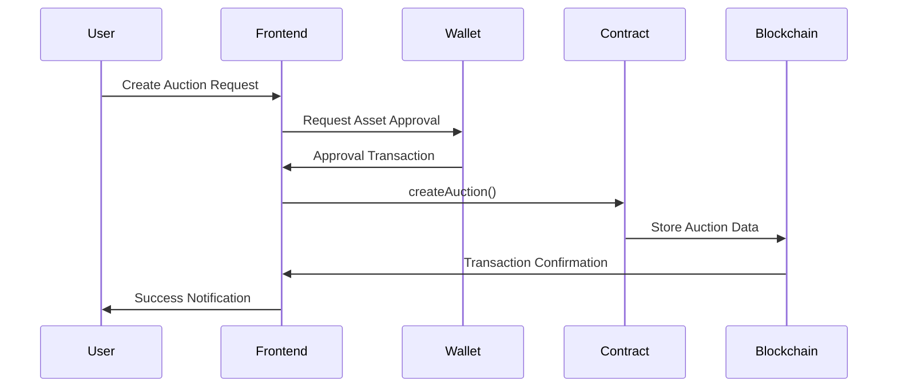
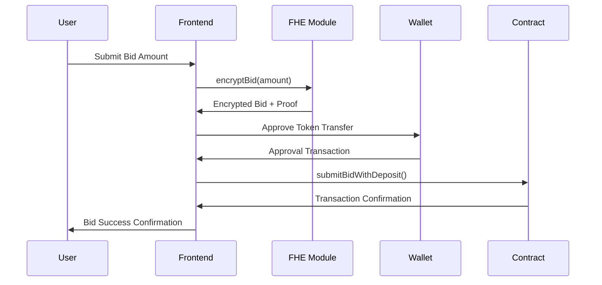

# 🏗️ Architecture Documentation

## Overview

PrivateBid is a decentralized auction platform that leverages **Fully Homomorphic Encryption (FHE)** to enable private bidding while maintaining transparency and fairness. The architecture consists of smart contracts on the FHEVM blockchain, a Next.js frontend, and Web3 integration layer.

## 🎯 Core Architecture Principles

### Privacy-Preserving Design
- **Encrypted Bids**: All bid amounts are encrypted using FHE before submission
- **Zero-Knowledge Proofs**: Each encrypted bid includes cryptographic proof of validity
- **Private Comparisons**: Smart contracts can compare encrypted values without decryption
- **Fair Auction Resolution**: Winners are determined while preserving bidder privacy

### Multi-Layer Security
1. **Blockchain Layer**: Immutable auction records and transaction history
2. **FHE Layer**: Homomorphic encryption for private computations
3. **Application Layer**: Secure frontend with proper Web3 integration
4. **Network Layer**: HTTPS and secure RPC connections

## 📐 System Architecture

```
┌─────────────────────────────────────────────────────────────┐
│                     Frontend Layer                          │
├─────────────────────────────────────────────────────────────┤
│  Next.js 14 + TypeScript + Tailwind CSS                    │
│  ├─ Pages: /auctions, /create, /me, /fhe-demo              │
│  ├─ Components: UI, Web3, FHE Integration                  │
│  └─ Hooks: useContract, useFHE, useWallet                  │
└─────────────────────────────────────────────────────────────┘
                              │
                              ▼ Web3 Connection
┌─────────────────────────────────────────────────────────────┐
│                    Web3 Integration                         │
├─────────────────────────────────────────────────────────────┤
│  Wagmi + Viem + WalletConnect                               │
│  ├─ Wallet Management                                       │
│  ├─ Contract Interaction                                   │
│  ├─ Transaction Handling                                   │
│  └─ Network Switching                                      │
└─────────────────────────────────────────────────────────────┘
                              │
                              ▼ RPC Calls
┌─────────────────────────────────────────────────────────────┐
│                  FHEVM Blockchain                           │
├─────────────────────────────────────────────────────────────┤
│  Smart Contracts                                            │
│  ├─ AuctionManager.sol: Main auction logic                 │
│  ├─ FHELiquidity.sol: FHE operations                       │
│  ├─ TestERC721.sol: NFT asset support                      │
│  └─ FHE Library: @fhevm/solidity/lib/FHE.sol               │
└─────────────────────────────────────────────────────────────┘
                              │
                              ▼ FHE Operations
┌─────────────────────────────────────────────────────────────┐
│                   FHE Infrastructure                        │
├─────────────────────────────────────────────────────────────┤
│  Zama FHEVM + TFHE-rs                                       │
│  ├─ Encrypted Value Operations                              │
│  ├─ Homomorphic Comparisons                                │
│  ├─ Zero-Knowledge Proofs                                  │
│  └─ Oracle-based Decryption                                │
└─────────────────────────────────────────────────────────────┘
```

## 🔐 FHE Integration Architecture

### Encryption Flow


### Key Components

#### 1. Frontend FHE Module (`frontend/lib/fhe.ts`)
- **TFHE-rs Integration**: WebAssembly library for client-side encryption
- **Proof Generation**: Zero-knowledge proofs for bid validity
- **Key Management**: Secure handling of encryption keys
- **Format Conversion**: Bid amount to encrypted format

```typescript
// Core encryption function
export async function encryptBid(amount: bigint): Promise<EncryptedBid> {
    // Initialize FHE environment
    await initializeFHE()

    // Encrypt bid amount using TFHE
    const encryptedValue = fhe.encrypt(amount)

    // Generate zero-knowledge proof
    const proof = await generateZKProof(amount, encryptedValue)

    return {
        encBid: encryptedValue,
        inputProof: proof
    }
}
```

#### 2. Smart Contract FHE Operations (`hardhat/contracts/AuctionManager.sol`)
- **Encrypted Storage**: Secure storage of encrypted bids
- **FHE Comparisons**: Compare encrypted values without decryption
- **Proof Verification**: Validate zero-knowledge proofs
- **Auction Logic**: Private bid comparison and winner selection

```solidity
// FHE comparison in smart contract
function compareBids(bytes memory bid1, bytes memory bid2)
    external view returns (bool) {
    // Compare encrypted bids without decryption
    return FHE.gt(bid1, bid2);
}
```

#### 3. Oracle Integration
- **Decryption Requests**: Secure request to FHE oracle
- **Result Verification**: Cryptographic verification of decrypted results
- **Privacy Preservation**: Selective decryption only when required

## 📋 Smart Contract Architecture

### Contract Hierarchy
```
AuctionManager (Main Contract)
├── Auction Management
│   ├── createAuction()
│   ├── submitBidWithDeposit()
│   ├── finalizeAuction()
│   └── withdrawDeposits()
├── FHE Operations
│   ├── submitEncryptedBid()
│   ├── revealAuctionStats()
│   └── findWinningBid()
└── Asset Management
    ├── ERC721 support
    ├── ERC1155 support
    └── ENS domain support

FHELiquidity (FHE Operations)
├── FHE Environment Setup
├── Encryption/Decryption Helpers
└── Oracle Management

TestERC721 (Asset Support)
├── NFT Minting
├── Transfer Operations
└── Approval Management
```

### Data Structures

#### Auction Structure
```solidity
struct Auction {
    address seller;
    address assetContract;
    uint256 assetId;
    uint256 assetType; // 0=ERC721, 1=ERC1155, 2=ENS, 3=Contract
    uint256 startPrice;
    uint256 reservePrice;
    uint256 startTime;
    uint256 endTime;
    uint256 sellerDeposit;
    uint256 bidderDeposit;
    bool finalized;
    address winner;
    uint256 winningBid;
}
```

#### Encrypted Bid Structure
```solidity
struct EncryptedBid {
    address bidder;
    bytes encBid;        // FHE encrypted bid amount
    bytes inputProof;    // Zero-knowledge proof
    uint256 depositAmount;
    uint256 timestamp;
    bool revealed;
    uint256 actualBid;   // Revealed after auction end
}
```

## 🎨 Frontend Architecture

### Component Structure
```
frontend/
├── app/                    # Next.js App Router
│   ├── page.tsx           # Homepage
│   ├── auctions/page.tsx  # Auction listings
│   ├── create/page.tsx    # Create auction
│   ├── me/page.tsx        # User dashboard
│   └── fhe-demo/page.tsx  # FHE demonstration
├── components/
│   ├── layout/            # Navigation and layout
│   ├── common/            # Reusable UI components
│   ├── auction/           # Auction-specific components
│   └── fhe/               # FHE demonstration components
├── lib/
│   ├── contracts.ts       # Contract configurations
│   ├── fhe.ts            # FHE operations
│   ├── utils.ts          # Utility functions
│   └── wagmi.ts          # Web3 configuration
├── hooks/
│   ├── useContract.ts    # Contract interaction hook
│   ├── useFHE.ts         # FHE operations hook
│   └── useWallet.ts      # Wallet management hook
└── contexts/
    ├── Web3Context.tsx   # Web3 state management
    └── FHEContext.tsx    # FHE state management
```

### State Management
- **Web3Context**: Wallet connection, account, network state
- **FHEContext**: FHE initialization, encryption status
- **Local State**: Component-specific UI state
- **Server State**: Cache for blockchain data

### Security Features
- **Input Validation**: All user inputs validated before processing
- **Error Handling**: Comprehensive error catching and user feedback
- **Secure Storage**: Sensitive data handled securely
- **XSS Protection**: Built-in Next.js security features

## 🔗 Integration Points

### 1. Wallet Integration
```typescript
// Wagmi configuration for multiple networks
const config = createConfig({
  chains: [localhost, sepolia, polygon],
  transports: {
    [localhost.id]: http(),
    [sepolia.id]: http(),
    [polygon.id]: http()
  },
  connectors: [
    injected(),
    walletConnect({ projectId: process.env.NEXT_PUBLIC_WALLETCONNECT_PROJECT_ID })
  ]
})
```

### 2. Contract Integration
```typescript
// Contract interaction pattern
const { data: auctionData, error } = useContractRead({
  address: AUCTION_MANAGER_ADDRESS,
  abi: AUCTION_MANAGER_ABI,
  functionName: 'getAuction',
  args: [auctionId]
})
```

### 3. FHE Integration
```typescript
// FHE encryption workflow
const handleBidSubmission = async (amount: bigint) => {
    // 1. Encrypt bid amount
    const { encBid, inputProof } = await encryptBid(amount)

    // 2. Submit to smart contract
    const tx = await writeContract({
        address: AUCTION_MANAGER_ADDRESS,
        abi: AUCTION_MANAGER_ABI,
        functionName: 'submitBidWithDeposit',
        args: [auctionId, encBid, inputProof],
        value: bidderDeposit
    })

    // 3. Wait for confirmation
    await tx.wait()
}
```

## 🚀 Deployment Architecture

### Local Development
```
Local Machine
├── Hardhat Node (Port 8545)
├── Frontend Dev Server (Port 3001)
├── Contract Deployment Scripts
└── Test Account Management
```

### Production Deployment
```
Production Environment
├── FHEVM Network (Mainnet/Testnet)
├── IPFS/Filecoin (Asset Storage)
├── Frontend Hosting (Vercel/Netlify)
├── RPC Providers (Infura/Alchemy)
└── Monitoring & Analytics
```

## 🔒 Security Considerations

### Smart Contract Security
- **Reentrancy Protection**: OpenZeppelin ReentrancyGuard
- **Access Control**: Role-based permissions
- **Input Validation**: Strict parameter checking
- **Emergency Functions**: Pause and rescue mechanisms

### Frontend Security
- **HTTPS Only**: Secure communication
- **Content Security Policy**: XSS prevention
- **Input Sanitization**: Clean user inputs
- **Secure Storage**: Avoid sensitive data in localStorage

### FHE Security
- **Key Management**: Secure encryption key handling
- **Proof Verification**: Validate all zero-knowledge proofs
- **Oracle Security**: Trusted decryption oracle
- **Privacy Preservation**: Minimum data disclosure

## 📊 Performance Considerations

### Blockchain Optimization
- **Gas Efficiency**: Optimized contract functions
- **Batch Operations**: Multiple bids in single transaction
- **State Management**: Efficient storage patterns
- **Event Logging**: Comprehensive event tracking

### Frontend Optimization
- **Code Splitting**: Lazy loading of components
- **Image Optimization**: Next.js Image component
- **Caching Strategy**: React Query for data caching
- **Bundle Size**: Tree shaking and minification

### FHE Performance
- **WebAssembly**: Efficient client-side encryption
- **Async Operations**: Non-blocking encryption
- **Progressive Loading**: Status feedback during operations
- **Error Recovery**: Graceful handling of FHE failures

## 🔄 Data Flow

### Auction Creation Flow


### Bid Submission Flow


This architecture ensures privacy, security, and scalability while providing an excellent user experience for private auctions using cutting-edge FHE technology.